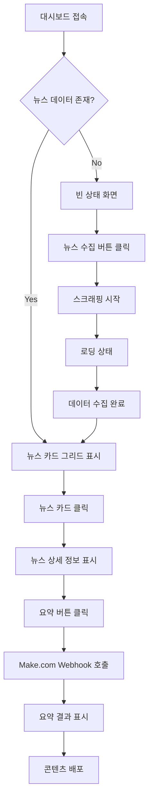

# AI Times News Dashboard Information Architecture 문서

## 프로젝트 개요

AI Times News Summary Dashboard는 솔로프레너 AI 엔지니어를 위한 개인 생산성 도구입니다. aitimes.com에서 상위 10개 뉴스 기사를 웹 스크래핑을 통해 자동 수집하고, Supabase에 메타데이터를 저장하며, 카드 기반 대시보드 인터페이스를 제공합니다. 핵심 기능은 원클릭 뉴스 수집, Make.com webhook integration을 통한 개별 기사 요약, 청중 배포를 위한 효율적인 workflow입니다.

## Site Map (SPA 구조)

```
AI Times Dashboard (/)
├── Header (로고, 검색바, 뉴스 수집 버튼, TOP 10 버튼, 설정)
├── Main Content (뉴스 카드 그리드 또는 빈 상태)
│   ├── Loading States (스켈레톤 UI)
│   ├── Empty States (데이터 없음, 검색 결과 없음)
│   └── Error States (토스트 알림)
└── Modal (뉴스 상세 + 요약 기능)
```

## 핵심 User Flow

1. **뉴스 수집**: 버튼 클릭 (뉴스 수집/TOP 10) → 스크래핑 → 카드 표시
2. **뉴스 검색**: 검색바 입력 → 실시간 필터링 → 결과 표시
3. **뉴스 요약**: 카드 클릭 → 모달 → 요약 버튼 → Make.com 호출 → 자동 업데이트



### Desktop 사용자 Flow

1. **초기 접속**
   - 대시보드 로드 → 기존 뉴스 데이터 확인 → 카드 그리드 표시

2. **뉴스 수집 Flow**
   - 헤더의 "뉴스 수집" 버튼 클릭 → 스크래핑 진행 상태 표시 → 새로운 카드들 그리드에 추가

3. **뉴스 요약 Flow**
   - 관심 뉴스 카드 클릭 → 상세 모달 오픈 → 요약 옵션 선택 → webhook 전송 → 결과 표시

### Mobile 사용자 Flow

1. **터치 최적화 인터랙션**
   - 카드 터치 → 풀스크린 상세 보기 → 스와이프 네비게이션

2. **간소화된 액션**
   - 하단 고정 액션 버튼 → 터치 친화적 모달 → 간단한 확인 과정

## Navigation Structure

### Primary Navigation (헤더)

```
┌─────────────────────────────────────────────────────────────┐
│ [Logo] AI Times Dashboard  [검색바]  [뉴스수집] [TOP10] [설정] │
└─────────────────────────────────────────────────────────────┘
```

#### Desktop Navigation
- **로고/브랜드**: 대시보드 홈 (새로고침 역할)
- **검색바**: 실시간 뉴스 검색 (디바운싱 300ms)
- **뉴스 수집 버튼**: 최신 뉴스 수집 (로딩 상태 표시)
- **TOP 10 버튼**: 인기 TOP 10 뉴스 수집 (별도 로딩 상태)
- **설정 메뉴**: 드롭다운으로 환경설정 접근

#### Mobile Navigation
- **햄버거 메뉴**: 주요 액션들을 모바일 친화적으로 정리
- **플로팅 액션 버튼**: 뉴스 수집을 위한 고정 버튼
- **스와이프 제스처**: 카드 간 빠른 이동

### Secondary Navigation (컨텍스트)

- **카드 내 액션**: 개별 뉴스의 세부 액션들
- **모달 네비게이션**: 상세 보기 내에서의 이동
- **브레드크럼**: 모달 및 다단계 프로세스에서 위치 표시

## Page Hierarchy

### Information Hierarchy

```
Level 1: Dashboard (최상위)
├── Level 2: News Collection Status (수집 상태)
├── Level 2: News Cards Grid (뉴스 카드들)
│   ├── Level 3: Individual News Card (개별 카드)
│   │   ├── Level 4: Card Metadata (메타정보)
│   │   ├── Level 4: Card Actions (액션 버튼들)
│   │   └── Level 4: Card Content Preview (내용 미리보기)
│   └── Level 3: Card Interaction States (상호작용 상태)
└── Level 2: System Status (시스템 상태)
```

### Visual Hierarchy

#### Desktop Layout
```
┌─────────────────────────────────────────────────┐
│                   HEADER                        │ ← Level 1
├─────────────────────────────────────────────────┤
│ Collection Status Bar                           │ ← Level 2
├─────────────────────────────────────────────────┤
│ ┌─────┐ ┌─────┐ ┌─────┐ ┌─────┐ ┌─────┐        │
│ │Card │ │Card │ │Card │ │Card │ │Card │        │ ← Level 3
│ │  1  │ │  2  │ │  3  │ │  4  │ │  5  │        │
│ └─────┘ └─────┘ └─────┘ └─────┘ └─────┘        │
│ ┌─────┐ ┌─────┐ ┌─────┐ ┌─────┐ ┌─────┐        │
│ │Card │ │Card │ │Card │ │Card │ │Card │        │
│ │  6  │ │  7  │ │  8  │ │  9  │ │ 10  │        │
│ └─────┘ └─────┘ └─────┘ └─────┘ └─────┘        │
├─────────────────────────────────────────────────┤
│                   FOOTER                        │ ← Level 1
└─────────────────────────────────────────────────┘
```

#### Mobile Layout
```
┌─────────────────┐
│     HEADER      │ ← Level 1
├─────────────────┤
│ Status Bar      │ ← Level 2
├─────────────────┤
│ ┌─────────────┐ │
│ │    Card 1   │ │ ← Level 3
│ └─────────────┘ │
│ ┌─────────────┐ │
│ │    Card 2   │ │
│ └─────────────┘ │
│       ...       │
├─────────────────┤
│ Fixed Actions   │ ← Level 2
└─────────────────┘
```

## Content Organization

### 컨텐츠 그룹핑 전략

#### 1. 시간 기반 조직
- **최신순 정렬**: 기본 정렬 방식
- **수집 시간 기준**: 배치별 그룹핑
- **게시 시간 기준**: 실제 뉴스 발행 시간

#### 2. 상태 기반 조직
- **신규 수집**: 아직 요약하지 않은 뉴스
- **요약 완료**: Make.com을 통해 요약이 완료된 뉴스
- **배포 완료**: 청중에게 공유가 완료된 뉴스

#### 3. 중요도 기반 조직
- **순위 반영**: aitimes.com의 원본 순위 유지
- **사용자 관심도**: 클릭 및 요약 빈도
- **내용 품질**: 자동 분석된 컨텐츠 품질 점수

### 컨텐츠 표시 전략

#### Desktop
- **5x2 그리드**: 10개 뉴스를 2행으로 배치 (CSS Grid 활용)
- **카드 구성**: 썸네일 + 순위 배지 + 메타정보 + 상태 배지 + 액션 버튼
- **상호작용**: 호버 시 elevation, 카드 클릭으로 모달 오픈
- **상태 표시**: "요약 완료", "본문 있음" 배지 시스템

#### Mobile
- **단일 컬럼**: 세로 스크롤 최적화 (반응형 디자인)
- **카드 크기**: 화면 너비 - 32px margin
- **터치 최적화**: 버튼 크기 44px 이상, 스와이프 지원

## Interaction Patterns

### 기본 상호작용 패턴

#### 1. 뉴스 수집 패턴
```
Trigger: 헤더 "뉴스 수집" 또는 "TOP 10" 버튼 클릭
Process: 
1. 해당 버튼 비활성화 + "수집 중..." 텍스트 변경
2. @tanstack/react-query를 통한 mutation 실행
3. 수집 완료 시 새 카드들 자동 표시 (쿼리 무효화)
4. 성공/실패 토스트 메시지 자동 표시

Feedback:
- Visual: 버튼 텍스트 변화 ("뉴스 수집" → "수집 중...")
- Textual: 토스트로 "최신 뉴스 수집 완료" 또는 "TOP 10 뉴스 수집 완료"
- Error: 실패 시 빨간색 토스트로 에러 메시지
```

#### 2. 실시간 검색 패턴
```
Trigger: 헤더 검색바에 텍스트 입력
Process:
1. 300ms 디바운싱으로 과도한 검색 방지
2. URL 쿼리 파라미터 자동 업데이트 (?query=검색어)
3. @tanstack/react-query로 검색 결과 실시간 업데이트
4. 검색 결과 없을 시 적절한 빈 상태 표시

Feedback:
- Visual: 검색 중 로딩 스피너, 결과 카드 실시간 필터링
- URL: 북마크 가능한 검색 상태 유지
- Empty: "검색 결과가 없습니다" 빈 상태 화면
```

#### 3. 카드 상호작용 패턴
```
Hover (Desktop):
- 카드 hover:shadow-lg hover:-translate-y-0.5 애니메이션
- 상태 배지 하이라이트 ("요약 완료", "본문 있음")
- 액션 버튼들 호버 효과

Click/Tap:
- 카드 영역 클릭 → 상세 모달 오픈 (onViewDetail)
- "원문보기" 버튼 → 새 탭에서 기사 URL 열기
- "요약하기" 버튼 → Make.com webhook 호출 (요약 중 상태 표시)

States:
- 요약 중: "요약하기" 버튼이 "요약 중..." 비활성화 상태
- 요약 완료: 녹색 "요약 완료" 배지 표시, 요약 버튼 숨김
```

#### 3. 모달 상호작용 패턴
```
Open Animation:
- Fade-in background overlay
- Scale-up 모달 컨테이너
- Content slide-in from bottom

Close Methods:
- ESC 키
- 배경 클릭
- X 버튼 클릭
- 뒤로가기 제스처 (모바일)

Content Navigation:
- 좌우 화살표로 다음/이전 뉴스
- 스와이프 제스처 (모바일)
```

### 상태 기반 인터랙션

#### Loading States
- **스켈레톤 UI**: 뉴스 그리드 로딩 시 (10개 카드 형태 스켈레톤)
- **버튼 로딩**: "수집 중...", "요약 중..." 텍스트로 상태 표시
- **React Query**: isLoading, isPending 상태 기반 UI 제어

#### Error States
- **토스트 알림**: shadcn/ui toast 컴포넌트 활용
- **뉴스 수집 실패**: 빨간색 토스트 + 재시도 버튼
- **요약 실패**: 에러 토스트 + 자동 상태 복원
- **네트워크 에러**: 연결 문제 감지 및 알림

#### Empty States
- **초기 상태**: "아직 수집된 뉴스가 없습니다" + 수집 버튼
- **검색 결과 없음**: "검색 결과가 없습니다" + 검색어 재설정 링크
- **EmptyState 컴포넌트**: type prop으로 상태별 UI 분기

## URL Structure

### Single-Page Application URL 스키마

```
Base URL: https://aitimes-news-dashboard.vercel.app

/ (Root)
├── ?query={검색어}       # 실시간 검색 상태
├── ?modal=news&id={id}   # 특정 뉴스 모달 오픈 (예정)
└── ?modal=settings       # 설정 모달 오픈 (예정)
```

### URL Parameters 정의

#### Query Parameters
- **query**: 검색어 (`?query=ChatGPT` - 북마크 및 공유 가능)
- **modal**: 활성 모달 (`news`, `settings` - 향후 구현 예정)
- **id**: 뉴스 고유 식별자 (UUID)

#### URL 변경 로직
```javascript
// 뉴스 카드 클릭 시
window.history.pushState({}, '', '/?modal=news&id=' + newsId);

// 모달 닫기 시
window.history.pushState({}, '', '/');

// 브라우저 뒤로가기 처리
window.addEventListener('popstate', handleUrlChange);
```

### Deep Linking 전략

#### 북마크 가능한 상태
- 특정 뉴스 상세 보기
- 에러 상태 (디버깅 목적)
- 설정 모달 (빠른 접근)

#### 임시 상태 (북마크 불가)
- 로딩 진행 상태
- 일시적 토스트 메시지
- 애니메이션 진행 중

## Component Hierarchy

### React Component 구조

```
Dashboard (page.tsx)
├── QueryClient Provider (@tanstack/react-query)
├── Toaster (shadcn/ui toast 시스템)
├── DashboardContent
│   ├── Header
│   │   ├── 로고 + 브랜드명
│   │   ├── 검색바 (useSearchParams + debounce)
│   │   ├── 뉴스 수집 버튼 (useMutation)
│   │   ├── TOP 10 수집 버튼 (useMutation)
│   │   └── 설정 버튼
│   ├── Main Content
│   │   ├── EmptyState (type별 다른 UI)
│   │   └── NewsGrid
│   │       └── NewsCard[] (썸네일, 순위, 메타정보, 상태 배지, 액션 버튼)
│   └── NewsDetailModal (selectedArticle 상태로 제어)
└── API Routes
    ├── /api/collect-news (최신 뉴스)
    ├── /api/collect-top10-news (TOP 10)
    └── /api/summarize (POST: 요약 요청, PUT: 요약 수신)
```

## 주요 상태 관리

- **React Query**: 서버 상태 관리 (뉴스 데이터, 캐싱, 무효화)
- **Local State**: 모달 열림/닫힘, 요약 중인 articleId
- **URL State**: 검색 쿼리 (useSearchParams)
- **Toast State**: 성공/실패 알림 (shadcn/ui useToast)