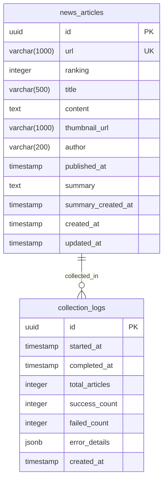

# AI Times News Dashboard ERD 문서

## 엔티티 정의

### 핵심 테이블 구조

AI Times News Dashboard는 간단하고 효율적인 데이터 구조를 위해 최소한의 테이블로 구성됩니다.

## ERD 다이어그램



## 테이블 상세 스펙

### news_articles (뉴스 기사)

| 컬럼명 | 데이터 타입 | 제약사항 | 설명 |
|--------|------------|---------|------|
| id | uuid | PRIMARY KEY, DEFAULT gen_random_uuid() | 고유 식별자 |
| url | varchar(1000) | UNIQUE, NOT NULL | 뉴스 기사 URL |
| ranking | integer | CHECK (ranking BETWEEN 1 AND 10) | aitimes.com 순위 (1-10) |
| title | varchar(500) | NOT NULL | 뉴스 제목 |
| content | text | | 뉴스 본문 내용 |
| thumbnail_url | varchar(1000) | | 썸네일 이미지 URL |
| author | varchar(200) | | 기사 작성자 |
| published_at | timestamp | | 기사 게시 일시 |
| summary | text | | AI 생성 요약 내용 |
| summary_created_at | timestamp | | 요약 생성 일시 |
| created_at | timestamp | DEFAULT NOW() | 수집 일시 |
| updated_at | timestamp | DEFAULT NOW() | 최종 수정 일시 |

**Note**: URL은 unique 제약으로 중복 수집 방지

### collection_logs (수집 로그)

| 컬럼명 | 데이터 타입 | 제약사항 | 설명 |
|--------|------------|---------|------|
| id | uuid | PRIMARY KEY, DEFAULT gen_random_uuid() | 고유 식별자 |
| started_at | timestamp | NOT NULL | 수집 시작 시간 |
| completed_at | timestamp | | 수집 완료 시간 |
| total_articles | integer | DEFAULT 10 | 시도한 기사 수 |
| success_count | integer | DEFAULT 0 | 성공한 기사 수 |
| failed_count | integer | DEFAULT 0 | 실패한 기사 수 |
| error_details | jsonb | | 오류 상세 정보 |
| created_at | timestamp | DEFAULT NOW() | 로그 생성 시간 |

**Note**: 디버깅 및 성능 모니터링 용도

## 관계 매핑

### 1:N 관계
- **collection_logs → news_articles**: 한 수집 세션에서 여러 뉴스 기사 수집
  - 카디널리티: 1:10 (항상 10개 기사)

## Primary/Foreign Key 구조

### Primary Keys
- `news_articles.id` (UUID)
- `collection_logs.id` (UUID)

### Unique Constraints
- `news_articles.url` (중복 URL 방지)

### Foreign Keys
관계를 단순화하여 Foreign Key 없이 구성 (로그는 독립적으로 관리)

## 인덱스 전략

### 기본 인덱스
```sql
-- 대시보드 메인 쿼리 최적화
CREATE INDEX idx_news_created_at ON news_articles(created_at DESC);
CREATE INDEX idx_news_ranking ON news_articles(ranking);

-- URL 기반 중복 체크용 (upsert에서 사용)
CREATE UNIQUE INDEX idx_news_url ON news_articles(url);

-- 검색 기능 최적화 (GIN 인덱스로 전문 검색)
CREATE INDEX idx_news_search_title ON news_articles USING GIN(to_tsvector('korean', title));
CREATE INDEX idx_news_search_content ON news_articles USING GIN(to_tsvector('korean', content));

-- 요약 상태 확인용 (UI 배지 표시)
CREATE INDEX idx_news_summary_null ON news_articles(created_at DESC) 
WHERE summary IS NULL;

-- 수집 로그 성능용
CREATE INDEX idx_collection_started_at ON collection_logs(started_at DESC);
```

### 복합 인덱스
```sql
-- React Query getLatestBatch 최적화
CREATE INDEX idx_news_latest_batch ON news_articles(created_at DESC, ranking ASC);

-- 검색 + 정렬 복합 쿼리 최적화
CREATE INDEX idx_news_search_sort ON news_articles(created_at DESC) 
WHERE title IS NOT NULL OR content IS NOT NULL;
```

## 제약사항 및 비즈니스 룰

### 데이터 제약사항
```sql
-- 순위 범위 제한
ALTER TABLE news_articles 
ADD CONSTRAINT chk_ranking_range 
CHECK (ranking BETWEEN 1 AND 10);

-- URL 형식 검증
ALTER TABLE news_articles 
ADD CONSTRAINT chk_url_format 
CHECK (url ~* '^https://www\.aitimes\.com/');

-- 제목 길이 제한
ALTER TABLE news_articles 
ADD CONSTRAINT chk_title_length 
CHECK (length(title) >= 5 AND length(title) <= 500);
```

### 비즈니스 룰
- **중복 방지**: URL 기준으로 동일 기사 중복 수집 차단
- **순위 유지**: aitimes.com 원본 순위(1-10) 보존
- **요약 추적**: 요약 생성 시 타임스탬프 자동 기록

## 데이터 타입 및 검증 규칙

### 타입 매핑
| 논리적 타입 | PostgreSQL 타입 | 검증 규칙 |
|------------|----------------|-----------|
| 기사 ID | uuid | UUID v4 형식 |
| URL | varchar(1000) | aitimes.com 도메인 체크 |
| 순위 | integer | 1-10 범위 |
| 제목 | varchar(500) | 5-500자 범위 |
| 본문 | text | 무제한 (실제론 50KB 이하) |
| 이미지 URL | varchar(1000) | HTTP(S) URL 형식 |
| 작성자 | varchar(200) | 특수문자 제한 |
| 일시 | timestamp | UTC 기준 |

### 검증 함수 예시
```sql
-- URL 검증 함수
CREATE OR REPLACE FUNCTION validate_aitimes_url(url text)
RETURNS boolean AS $$
BEGIN
    RETURN url ~* '^https://www\.aitimes\.com/news/articleView\.html\?idxno=\d+$';
END;
$$ LANGUAGE plpgsql;
```

## 정규화 분석

### 3NF 준수 확인
- **1NF**: 모든 컬럼이 원자값 ✅
- **2NF**: 모든 비키 속성이 기본키에 완전 함수 종속 ✅
- **3NF**: 이행적 종속성 제거 ✅

### 의도적 비정규화
- `summary` 필드를 별도 테이블로 분리하지 않음 (성능 최적화)
- 자주 조회되는 메타데이터를 단일 테이블에 집중

## 성능 최적화 고려사항

### 핵심 쿼리 패턴 및 최적화

#### 1. 대시보드 메인 화면 쿼리
```sql
-- 최신 수집 배치의 뉴스들 (React Query getLatestBatch)
SELECT id, url, ranking, title, thumbnail_url, author, published_at,
       summary IS NOT NULL as has_summary,
       summary, summary_created_at,
       created_at
FROM news_articles 
ORDER BY created_at DESC, ranking ASC
LIMIT 10;

-- 검색 쿼리 (React Query search)
SELECT id, url, ranking, title, thumbnail_url, author, published_at,
       summary IS NOT NULL as has_summary,
       summary, summary_created_at,
       created_at
FROM news_articles 
WHERE title ILIKE '%검색어%' OR content ILIKE '%검색어%'
ORDER BY created_at DESC;
```

#### 2. 요약 관련 쿼리
```sql
-- Make.com 요약 요청용 기사 조회 (API에서 사용)
SELECT id, url, title, content
FROM news_articles 
WHERE id = $1;

-- Make.com 콜백 요약 업데이트
UPDATE news_articles 
SET summary = $2, 
    summary_created_at = NOW(),
    updated_at = NOW()
WHERE id = $1
RETURNING id, title, summary;

-- 요약이 없는 기사들 조회 (UI에서 버튼 표시용)
SELECT id, title, url 
FROM news_articles 
WHERE summary IS NULL 
ORDER BY created_at DESC;
```

#### 3. 수집 이력 조회 쿼리
```sql
-- 최근 수집 세션들 성공률 확인
SELECT 
    DATE(started_at) as collection_date,
    COUNT(*) as total_sessions,
    AVG(success_count::float / total_articles) as success_rate
FROM collection_logs 
WHERE started_at >= NOW() - INTERVAL '30 days'
GROUP BY DATE(started_at)
ORDER BY collection_date DESC;
```

### 성능 튜닝 포인트
1. **파티셔닝**: 월별 파티션 고려 (데이터 증가 시)
2. **캐싱**: 대시보드 메인 쿼리 Redis 캐싱
3. **커넥션 풀링**: Supabase 기본 풀링 활용

## Migration 및 Versioning 전략

### 초기 스키마 생성
```sql
-- V1.0.0: 기본 테이블 생성
CREATE TABLE news_articles (
    id uuid PRIMARY KEY DEFAULT gen_random_uuid(),
    url varchar(1000) UNIQUE NOT NULL,
    ranking integer CHECK (ranking BETWEEN 1 AND 10),
    title varchar(500) NOT NULL,
    content text,
    thumbnail_url varchar(1000),
    author varchar(200),
    published_at timestamp,
    summary text,
    summary_created_at timestamp,
    created_at timestamp DEFAULT NOW(),
    updated_at timestamp DEFAULT NOW()
);

CREATE TABLE collection_logs (
    id uuid PRIMARY KEY DEFAULT gen_random_uuid(),
    started_at timestamp NOT NULL,
    completed_at timestamp,
    total_articles integer DEFAULT 10,
    success_count integer DEFAULT 0,
    failed_count integer DEFAULT 0,
    error_details jsonb,
    created_at timestamp DEFAULT NOW()
);
```

### RLS 정책 설정
```sql
-- Supabase Row Level Security 활성화
ALTER TABLE news_articles ENABLE ROW LEVEL SECURITY;
ALTER TABLE collection_logs ENABLE ROW LEVEL SECURITY;

-- 개인용 도구이므로 모든 접근 허용 (추후 세분화 가능)
CREATE POLICY "Allow all operations" ON news_articles FOR ALL USING (true);
CREATE POLICY "Allow all operations" ON collection_logs FOR ALL USING (true);
```
### 버전 관리 전략
- **시맨틱 버저닝**: Major.Minor.Patch (1.0.0)
- **마이그레이션 파일**: timestamp 기반 네이밍
- **롤백 계획**: 각 마이그레이션별 DOWN 스크립트 준비

**Note**: Supabase의 자동 백업 기능을 활용하여 마이그레이션 전 데이터 보호
